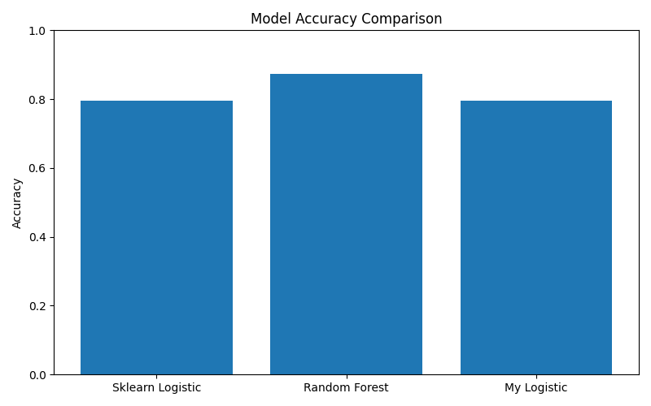
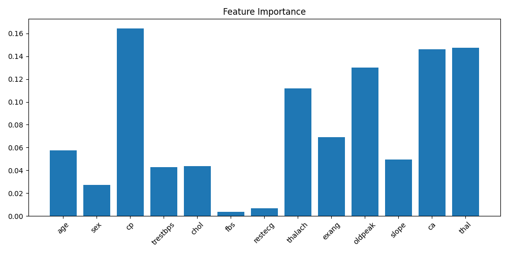
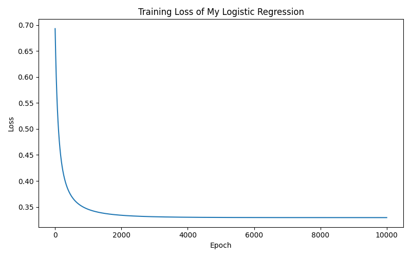

# ❤️ Heart Disease Risk Prediction / Kalp Hastalığı Risk Tahmini

---

## 🚀 Project Overview / Proje Özeti

**EN:**
This project predicts the risk of heart disease using machine learning models and a custom-built model from scratch.

**TR:**
Bu proje, makine öğrenmesi modelleri ve sıfırdan oluşturulmuş bir model kullanarak kalp hastalığı riskini tahmin eder.

---

## 🧠 Models Used / Kullanılan Modeller

* Logistic Regression (Scikit-learn)
* Random Forest (Scikit-learn)
* Custom Logistic Regression (NumPy ile sıfırdan)

---

## 📊 Model Performance / Model Performansı

| Model               | Accuracy |
| ------------------- | -------- |
| Logistic Regression | 0.79     |
| Random Forest       | 0.87     |
| Custom Logistic     | 0.79     |

---

## 📈 Visualizations / Görselleştirmeler

### 🔹 Model Comparison



### 🔹 Feature Importance



### 🔹 Training Loss Curve



---

## 🖥️ Streamlit App / Uygulama

**EN:**
The project includes a Streamlit-based interface where users can input patient data and get predictions.

**TR:**
Projede, kullanıcıların hasta bilgilerini girerek tahmin alabileceği bir Streamlit arayüzü bulunmaktadır.

**Outputs / Çıktılar:**

* Risk Prediction (High / Low)
* Probability Score (Olasılık değeri)

---

## 🧪 Features Used / Kullanılan Özellikler

* Age (Yaş)
* Sex (Cinsiyet)
* Chest Pain Type (Göğüs ağrısı tipi)
* Resting Blood Pressure
* Cholesterol
* Fasting Blood Sugar
* Resting ECG
* Max Heart Rate
* Exercise Induced Angina
* ST Depression
* Slope
* Number of Major Vessels
* Thalassemia

---

## ⚙️ Installation / Kurulum

```bash
git clone https://github.com/sumeyyeep1/heart-disease-prediction.git
cd heart-disease-prediction
pip install -r requirements.txt
```

---

## ▶️ Run the App / Uygulamayı Çalıştırma

```bash
streamlit run app.py
```

---

## 📁 Project Structure / Proje Yapısı

```
heart_risk_project/
│
├── app.py
├── trainmodel.py
├── best_model.pkl
├── heart.csv
├── requirements.txt
│
├── model_comparison.png
├── feature_importance.png
├── loss_curve.png
│
└── README.md
```

---

## 📌 Key Learnings / Öğrenilenler

**EN:**

* Built a machine learning model from scratch
* Compared different ML models
* Deployed a real-time prediction app

**TR:**

* Sıfırdan makine öğrenmesi modeli geliştirme
* Farklı modelleri karşılaştırma
* Gerçek zamanlı uygulama geliştirme

---
##Screenshots


## 👩‍💻 Author / Geliştirici

**Sümeyye Polat**
Software Engineering Student

---
